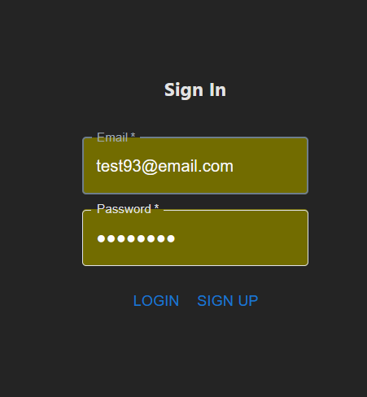
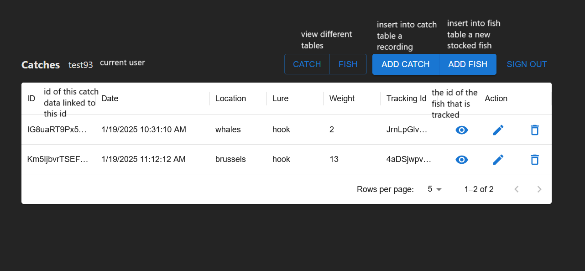
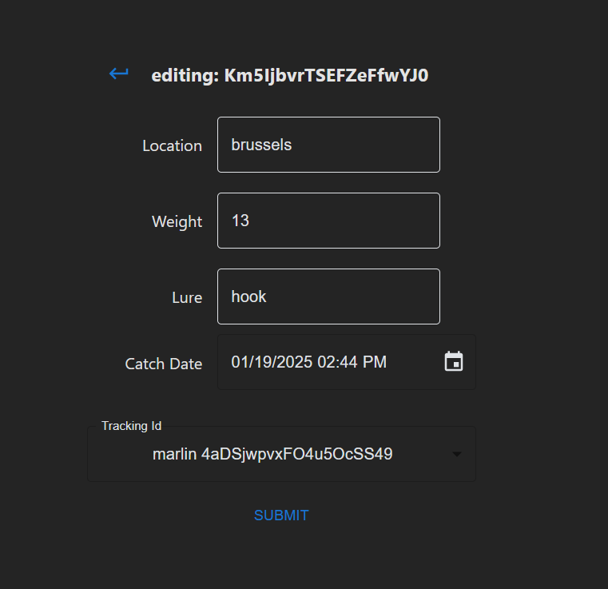
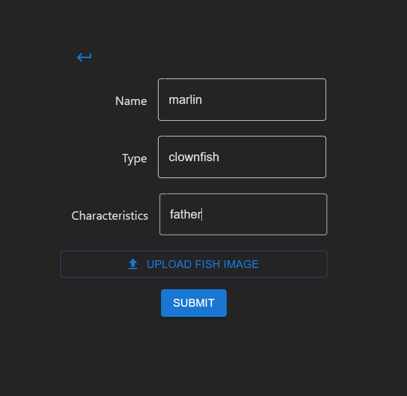
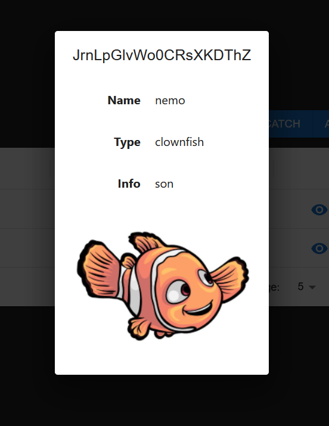

# Stock

A fish stock inventory management system.

The app allows admins to add fish, and report catches so that they can better monitor the health of the stock.
It allows uploading of fish metrics like weight and type of lure used when checking inventory. 
As well as profile images of each fish and characteristics of those fish.

## Architecture

This app uses Firebase, React, MaterialUI and is written in TypeScript

- Firebase was chosen for it's rapid iterability and ease of authentication
- React was chosen for the ability to make reusable components which interface with Firestore
- MaterialUI was chosen for its `DataGrid` and material design components such as `DateTimePicker`

### Authentication

The app uses Firebase for authentication and user authorization.
Registration of new 'user' accounts is openly allowed while 'admin' accounts need special authorization.

Login to the application uses `signInWithEmailAndPassword(...)` from the Firebase authentication scheme.

### Folder Structure

- components (reusable components)
- services (helper services, and complex business rules)
- models (main types of objects in the application)
- pages (main dashboards and error pages) main types are:
  - Dashboard (the main pages which give access to all features)
  - EditX (the place to edit firebase docs)
  - DataFrame (table representation of firebase collections)
  - Adhoc pages are used for things like Error Page

#### DataFrame Example

This showcases one of the dashboard pages

### Component Structure

- `X.component` (tsx syntax component code)
- `X.service` (functions for firebase calls)
- `X.model` (interfaces for autocomplete and component properties)

### Possible Improvements

- adding a custom FirebaseService class to handle `getFirestore(FirebaseApp)` repeated code
- passing button groupings in the dataframes as a property or create a custom component

### Routing

Routing is handled by `react-router-dom` allowing us to create a react router with parameters such as `/EditCatch/:id`

Elements are passed to the router creation in `router.tsx` and have the following format with guards for admin routes.

`element: <RedirectRouteGuard element={<EditCatch ... />} />`

The route guards allow for checking if a user `isAdmin()` prior to rendering the React element representing the page.

## Installation

- cloning the repository, having npm, and vite installed
- running `npm i` in the root directory
- once installed `npm run dev` will start the application for testing
- the app can also be tested as hosted with firebase

### Database Connection

In order to properly test the application database connections are needed these are stored outside of source in `.env` and loaded by Vite
the only off nominal collection needed is `admin` which contains documents of `{emails}` for users which are admins in the application

## Application Use

### Admin Functionality 

Admins are allowed to (additional to Read) perform Create, Update, Delete functionality on both Fish and Catches

This is ensured at the app, route, and database lebel, the later of which is guarded with Firebase security rules such as

`allow write: if request.auth != null && exists(/databases/$(database)/documents/admins/$(request.auth.token.email))`

The navigation bar will reflect the capabilities of the current user roles.

### View Functionality

Both Admin and 'User' type users are allowed to view information about each catch and fish via the dataframes and dialogs

o
